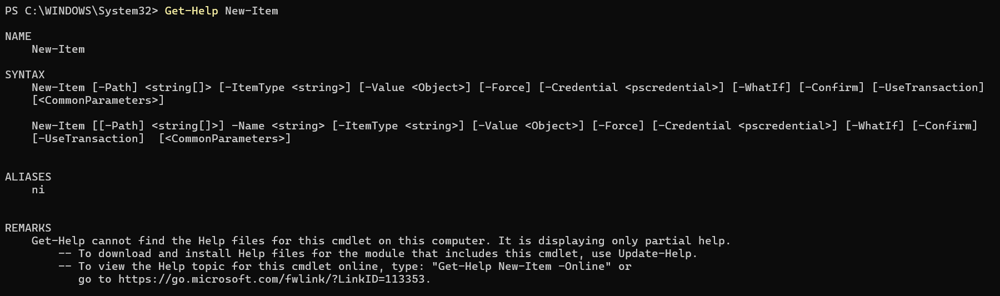
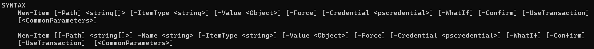
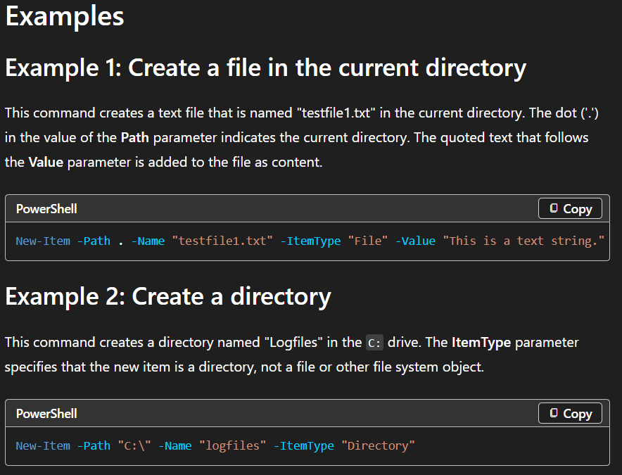
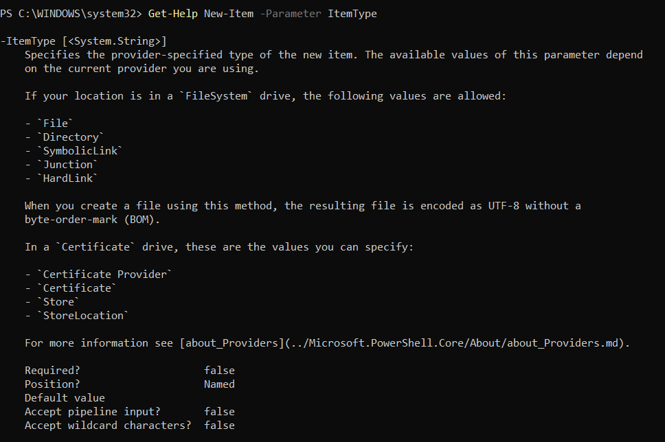
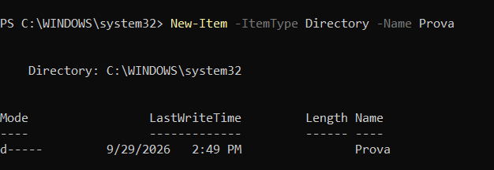
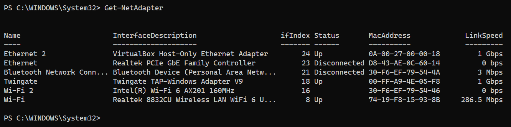
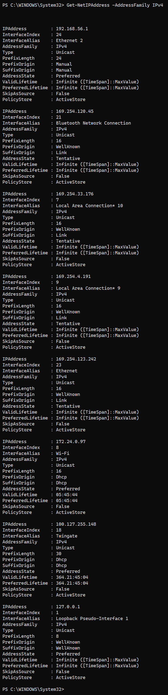
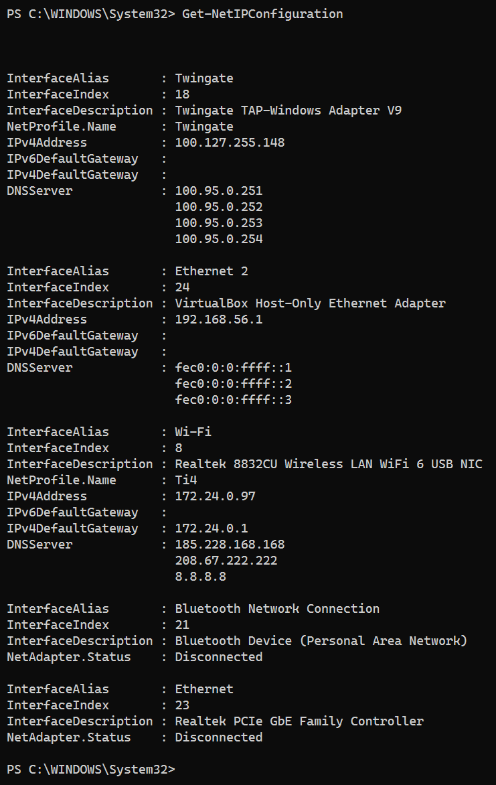
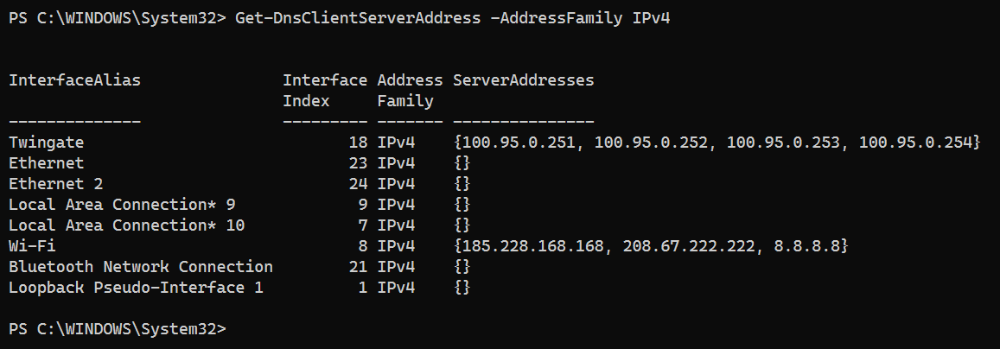
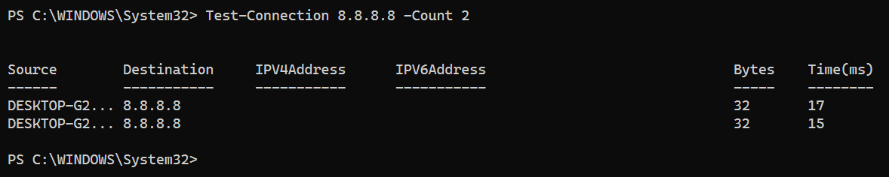

> **Nota**: Els exercicis/pràctiques t'han de servir per a familiarizar-te amb el llenguatge Powershell. Aprofita per a realitzar diverses proves i veure què passa. Documenta també aquestes proves i resultats.

# Treballar amb fitxers i carpetes

**Situació:** encara no hem estudiat les ordres de PowerShell per treballar amb fitxers i carpetes. Les haurem de descobrir utilitzant les eines d'ajuda de PowerShell.

**1. Buscar ordres**

Busca cmdlets que continguin la paraula `Item`:

```
Get-Command *Item*
```

Observa les ordres que apareixen.

Intenta identificar quina ordre podria servir per:

- crear un element;
    
    New-Item

- eliminar un element;

    Remove-Item

- canviar el nom d'un element;

    Rename-Item

- copiar un element;

    Copy-Item

- moure un element.

    Move-Item

---

**2. Investigar una ordre**

Sense executar-la encara, consulta què fa:

```
Get-Help New-Item
```


Respon:

- Per a què serveix `New-Item`?

    Serveix per crear nous recursos com carpetes 

- Quina estructura té l'ordre?

    Te la seguent estructura:
    

Consulta alguns exemples:

```
Get-Help New-Item -Examples
```

---

**3. Descobrir un paràmetre**

Consulta què significa el paràmetre `-ItemType`:

```
Get-Help New-Item -Parameter ItemType
```

A partir de l'ajuda, intenta descobrir com crear una carpeta.

Per exemple, haurien d'arribar a alguna cosa semblant a:

```
New-Item -ItemType Directory -Name Prova
```

---

**4. Nou repte**

Ara necessites saber com **canviar el nom de la carpeta**, però no coneixes l'ordre.

Utilitza:

```
Get-Command *Item*
```

i després consulta l'ajuda de l'ordre que creguis adequada.

L'objectiu és arribar a descobrir:

```
Rename-Item
```

i consultar:

```
Get-Help Rename-Item -Examples
```

---

Sense utilitzar Internet, descobreix quins cmdlets faries servir per:

1. crear una carpeta;

    Amb `Get-Command *Item*` he vist `New-Item`. He consultat `Get-Help New-Item` i `Get-Help New-Item -Examples`, i l'exemple 2 crea un directori amb `-ItemType Directory`.
Cmdlet: `New-Item -ItemType Directory -Name Prova`

2. canviar-li el nom;

    Amb `Get-Command *Item*` he vist `Rename-Item`. He consultat `Get-Help Rename-Item -Examples`, i l'exemple 1 fa servir `-Path` i `-NewName`.
Cmdlet: `Rename-Item -Path Prova -NewName Prova2`

3. copiar-la;

    Amb `Get-Command *Item*` he vist `Copy-Item`. He consultat `Get-Help Copy-Item -Examples`, i l'exemple 3 copia una carpeta amb el contingut usant `-Recurse`.
Cmdlet: `Copy-Item -Path Prova2 -Destination Copia -Recurse`

4. moure-la;

    Amb `Get-Command *Item*` he vist `Move-Item`. He consultat `Get-Help Move-Item -Examples`, i l'exemple 2 mou una carpeta amb `-Path` i `-Destination`.
Cmdlet: `Move-Item -Path Prova2 -Destination C:\Logs`

5. eliminar-la.

    Amb `Get-Command *Item*` he vist `Remove-Item`. He consultat `Get-Help Remove-Item -Examples`, i per esborrar una carpeta amb contingut hi afegeixo `-Recurse`.
Cmdlet: `Remove-Item -Path Prova2 -Recurse`


**Condició:** només pots utilitzar `Get-Command` i `Get-Help` per investigar les ordres.

Descobrir ordres de xarxa amb PowerShell

## Situació

Estàs administrant un servidor Windows i necessites consultar informació de la seva configuració de xarxa.

Encara no coneixes les ordres de PowerShell relacionades amb xarxa.

La teva feina és descobrir-les utilitzant principalment:

```
Get-Command
Get-Help
```

No pots buscar les respostes a Internet.

---

## Tasques

Descobreix quines ordres de PowerShell et permeten obtenir la informació següent:

1. Mostrar els adaptadors de xarxa de l’equip.   

    - **Cmdlet:** `Get-NetAdapter`
    - **Com l'he trobat:** `Get-Command *NetAdapter*`
    - **Resultat:** Wi-Fi (Up, 286.5 Mbps), Ethernet 2 (Up, 1 Gbps), Ethernet (Disconnected)...

    

2. Consultar les adreces IP configurades. 

    - **Cmdlet:** `Get-NetIPAddress`
    - **Com l'he trobat:** `Get-Command *NetIP*`
    - **Resultat:** Wi-Fi 172.24.0.97/16, Ethernet 2 192.168.56.1/24, loopback 127.0.0.1/8...

    

3. Consultar la configuració IP completa dels adaptadors de xarxa.

    - **Cmdlet:** `Get-NetIPConfiguration`
    - **Com l'he trobat:** `Get-Command *NetIPConfiguration*`
    - **Resultat:** Wi-Fi amb IP 172.24.0.97, gateway 172.24.0.1 i DNS 185.228.168.168, 208.67.222.222 i 8.8.8.8.

    

4. Consultar els servidors DNS configurats.   

    - **Cmdlet:** `Get-DnsClientServerAddress`
    - **Com l'he trobat:** `Get-Command *Dns*Client*`
    - **Resultat:** Wi-Fi amb 185.228.168.168, 208.67.222.222 i 8.8.8.8.

    

5. Comprovar si hi ha connectivitat amb un altre equip de la xarxa.  

    - **Cmdlet:** `Test-Connection`
    - **Com l'he trobat:** `Get-Command *Connection*`
    - **Resultat:** 2 respostes correctes (19 ms i 17 ms).

    


---
## Per cada tasca

Indica:

- el cmdlet que has trobat;      
- com l’has localitzat amb `Get-Command`;  
- una breu explicació del que fa;  
- la comanda que has executat;  
- el resultat obtingut.  

L'objectiu és que hi hagi una traçabilitat de com s'ha arribat a la comanda final.