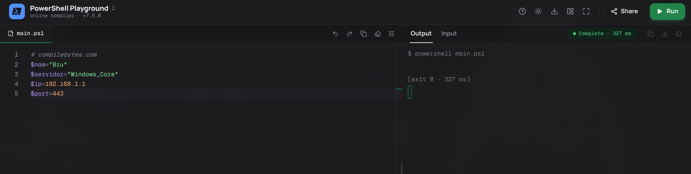
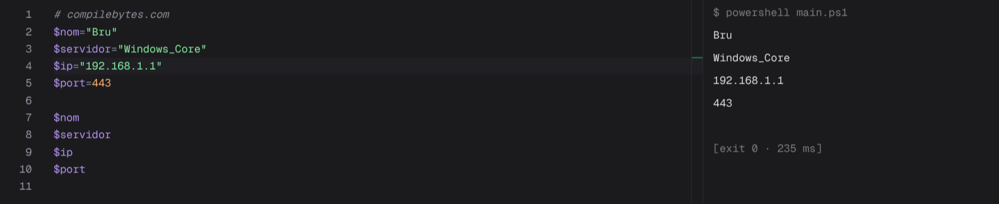
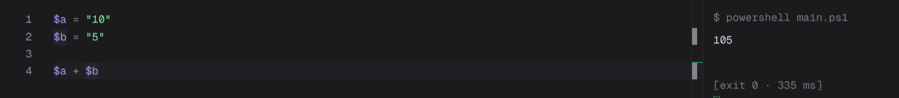
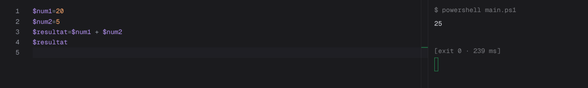
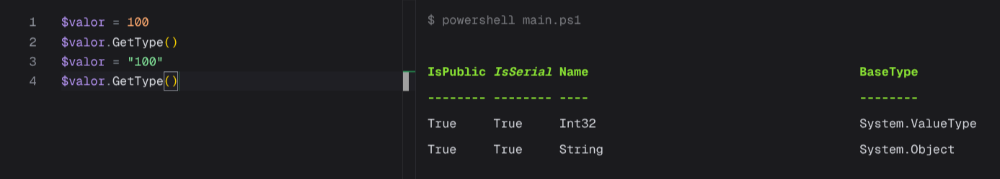
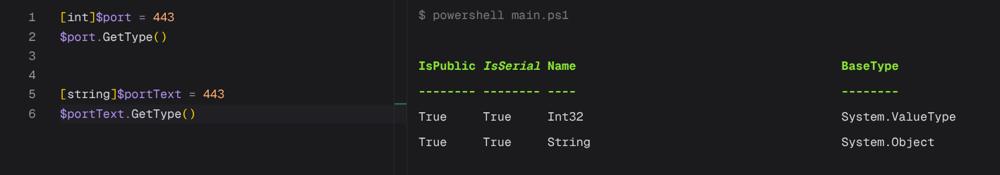
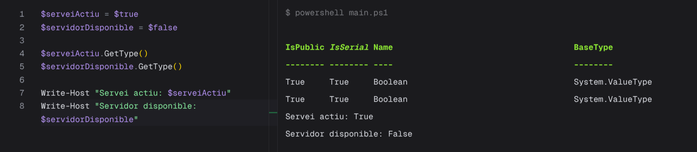

> **Nota**: Els exercicis/pràctiques t'han de servir per a familiarizar-te amb el llenguatge Powershell. Aprofita per a realitzar diverses proves i veure què passa. Documenta també aquestes proves i resultats.
# Tipus de dades

## 1. Identificar tipus

Crea les variables següents:
```powershell
$nom = "Servidor01"
$port = 443
$actiu = $true
$espai = 12.5
```
Consulta el tipus de cadascuna amb:
```powershell
.GetType()
```
Completa una taula com aquesta:

| Variable | Valor        | Tipus |
| -------- | ------------ | ----- |
| $nom     | `Servidor01` | String      |
| $port    | `443`        | Int32|
| $actiu   | $true        | Boolean     |
| $espai   | `12.5`       |   Double   |



## 2. Número o text?

Executa:
```powershell
$a = 10
$b = 5

$a + $b


```
Després:
```powershell
$a = "10"
$b = "5"

$a + $b
```
Respon:

- Quin resultat obtens en cada cas?

    Primer cas:
    

    Segon cas:
    

- Per què no és el mateix?

    Perque en el primer cas estem sumant dos numeros pero en el segon estem sumant dos "lletres" un estring per la qual cosa apareixen un al costat de l'altre. 


- Quin tipus tenen $a i $b en cada cas?

    El primer cas es una variable tipus integre i el segon cas es un estring:
    
## 3. Canviar el tipus d'una variable

Executa:
```powershell
```
Consulta:
```powershell
$valor.GetType()
```
Ara executa:
```powershell
$valor = "100"
```
i torna a consultar:
```powershell
$valor.GetType()
```
Respon:

**Ha canviat el valor? Ha canviat el tipus?**

Si, ha canviat perque powershell s'ha adaptat a el nou format del seu contingut. 


## 4. Tipus explícits

Executa:
```powershell
[int]$port = 443
```
Comprova el tipus:
```powershell
$port.GetType()
```
Ara prova:
```
[string]$portText = 443
```
Consulta també:
```powershell
$portText.GetType()
```
Respon:

**Tot i que visualment els dos valors semblen `443`, són del mateix tipus?**

No perque en aquest cas hem definit quin tipus de variable voliem per la qual cosa powershell el mantindra a no ser que l'hi indiquis el contrari.


## 5. Booleans

Crea:
```powershell
$serveiActiu = $true
$servidorDisponible = $false
```
Consulta els tipus.

Després mostra un missatge amb:
```
Write-Host "Servei actiu: $serveiActiu"
Write-Host "Servidor disponible: $servidorDisponible"
```


## 6. General

Crea variables per representar un servidor amb aquesta informació:
```
Nom: SRV-WEB01
Port: 443
Espai lliure: 125.7 GB
Actiu: True
```
Després:

1. mostra el valor de totes les variables;
2. consulta el tipus de cadascuna;
3. indica quin tipus de dada has utilitzat per cada valor.

    Nom: String perque es un text
    Port: String perque un port no ha de aplicar a calculs
    Espai: Un integre perque s'hi safageix espai en el futur es pugui sumar.
    Actiu: Booleant perque representa un valor de si o no. 
    