> **Nota:** Els exercicis i pràctiques t'han de servir per familiaritzar-te amb el llenguatge PowerShell. Aprofita per fer diverses proves i observar què passa. **Documenta també les proves que facis i els resultats obtinguts.**

# Pipeline

## 1. Primer pipeline

Executa:

```powershell
Get-Service
```

Ara executa:

```powershell
Get-Service | Sort-Object Name
```

Respon:

1. Quina diferència observes entre les dues sortides?

    Una esta ordenada alfabeticament i l'altre no

2. Què fa la part situada abans de `|`?

    Busca tots els processos

3. Què fa la part situada després de `|`?

    Utilitza la variable nom dels processos per ordenar-los

4. `Sort-Object` crea els serveis o rep serveis creats per una altra ordre?

    Reb els serveis creats per la ordre de Get-Service mirant nom. 

5. Quina ordre és la que genera inicialment les dades?

    Get-service

Fes ara la prova:

```powershell
Get-Service | Sort-Object Status
```

Què ha canviat?

> Primer indica els serveis parats i llavors els iniciats.

Finalment:

```powershell
Get-Service | Sort-Object Status -Descending
```
> Ens dona els serveis engegats i llavors els parats

Explica amb les teves paraules què ha fet el pipeline.

> El pipeline guarda la sortida de Get-Service, llavors es crida la variable status fent sort-object status i s'ordena al inrevers amb -Descending.

---

## 2. El mateix problema sense pipeline

Executa:

```powershell
$serveis = Get-Service
```

Ara:

```powershell
$serveis
```

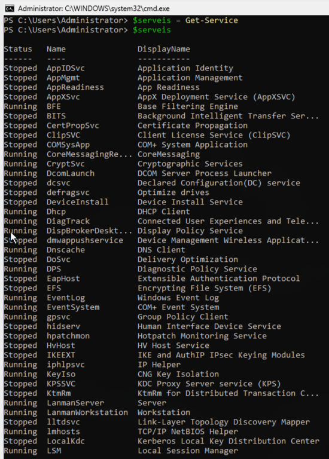

I després:

```powershell
$serveis | Sort-Object Name
```
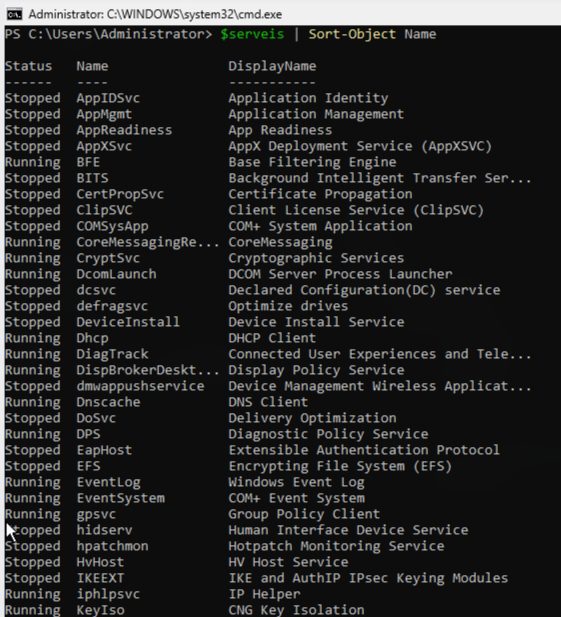


Compara-ho amb:

```powershell
Get-Service | Sort-Object Name
```
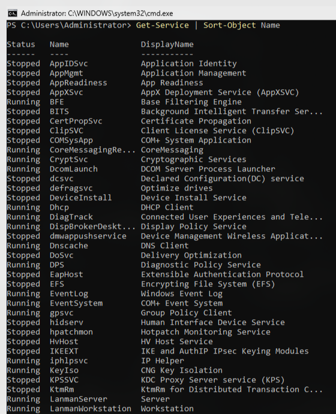
Respon:

1. Obtenen el mateix resultat?
>Si
2. Quina diferència hi ha entre les dues formes de treballar?
>Una es executant la comanda directament, l'altre es cridant una variable que ocnte el mateix contingut que la comanda.
3. En quin cas s'ha guardat prèviament la informació en una variable?
>$serveis | Sort-Object Name

Crea ara:

```powershell
$serveisOrdenats = Get-Service | Sort-Object Name
```

Mostra:

```powershell
$serveisOrdenats
```


Explica què conté aquesta variable.

---

>conte el resultat de la ordenaició alfabetica per nom dels serveis.

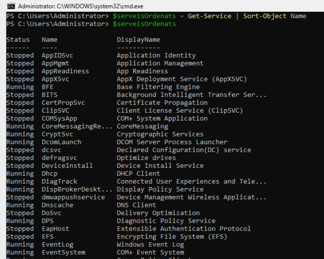

## 3. Construir un pipeline pas a pas

Executa primer:

```powershell
Get-Process
```

Ara:

```powershell
Get-Process | Sort-Object CPU
```

Finalment:

```powershell
Get-Process |
    Sort-Object CPU |
    Select-Object -First 5
```

No continuïs fins haver observat el resultat de cada ordre.

Completa:

| Pas | Ordre | Què entra? | Què surt? |
|---|---|---|---|
| 1 | `Get-Process` |Entren tots els processos |Tots els processos |
| 2 | `Sort-Object CPU` |Entren tots els processos |Tots els processos ordenats per el us de CPU |
| 3 | `Select-Object -First 5` |Entren tots els processos |Els ultims cinc processos ordenats per us de CPU |

Explica què passaria si eliminéssim:

```powershell
Sort-Object CPU
```

del pipeline.

Comprova-ho executant:

```powershell
Get-Process | Select-Object -First 5
```

Els cinc processos obtinguts són necessàriament els que consumeixen més CPU?

>No

Explica per què.

>Hara no els estem ordenant perque hem tret el Sort-Object CPU

---

## 4. Ordenar processos

Emmagatzema en una variable tots els processos que s'estan executant ordenats de **major a menor consum de CPU**.

Mostra després el contingut de la variable.

A partir de la variable anterior:

1. mostra els tres primers processos;
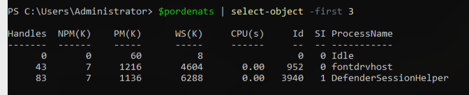
2. mostra els cinc primers;
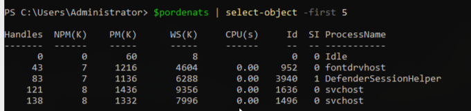
3. mostra els deu primers.
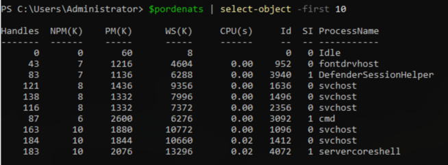

No tornis a executar `Get-Process` per fer aquests tres apartats.

---

## 5. Canviar l'ordre del pipeline

Executa:

```powershell
Get-Process |
    Sort-Object CPU -Descending |
    Select-Object -First 5
```
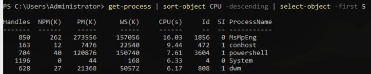
Ara executa:

```powershell
Get-Process |
    Select-Object -First 5 |
    Sort-Object CPU -Descending
```
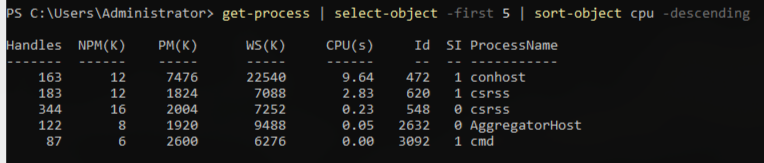
Respon:

1. Les dues ordres fan el mateix?
>no
2. Per què?
>Perque una ordena alfabeticament des de tots els resultats, l'altre nomes ordena alfabeticament amb els 5 processos que ha agafat. 
3. Quants processos arriben a `Sort-Object` en el primer cas?
>68
4. Quants processos arriben a `Sort-Object` en el segon?
>5

Aquest exercici és important: **l'ordre dels cmdlets dins del pipeline modifica el resultat**.

---

## 6. Fitxers i carpetes

Executa:

```powershell
Get-ChildItem
```

Ara ordena el resultat pel nom.

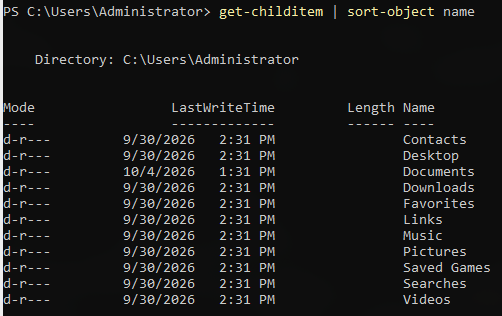

Després ordena'l segons la seva mida.

> Pista: observa les dades que mostra `Get-ChildItem`.

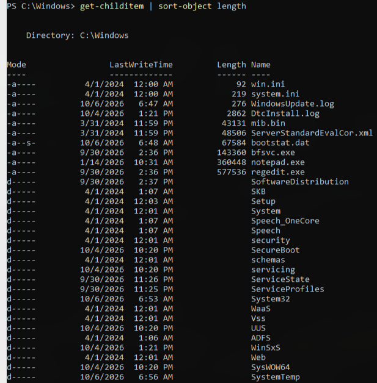

Mostra per pantalla els dos elements més grans.

Després:

1. mostra els tres elements més petits;

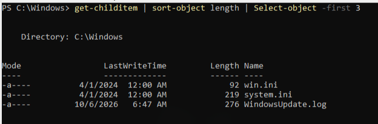

2. mostra els cinc elements més grans;

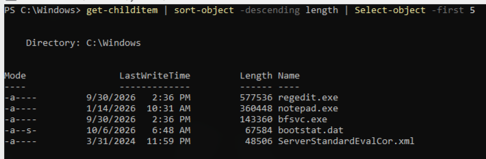

3. guarda aquests cinc elements en una variable.


Comprova el contingut de la variable.

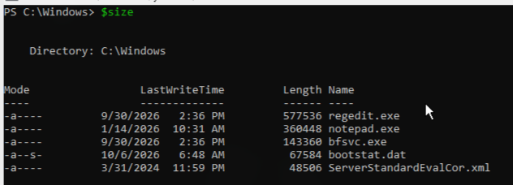

---

## 7. Modificar progressivament una ordre

Parteix de:

```powershell
Get-ChildItem
```

Transforma-la progressivament fins aconseguir:

```text
Mostrar només els tres elements més grans.
```

Documenta cada pas.

Per exemple:

```text
Pas 1 → obtenir elements
Pas 2 → ...
Pas 3 → ...
```
>Pas 1: Aconseguim tots els elements  
>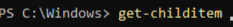

>Pas 2: Ordenem el temany de manera descendent ja que per default ho fa de mes petit a mes gran  
>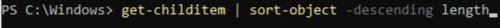

>Pas 3: Agafem els 3 priemrs
>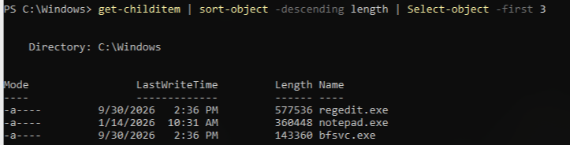

No escriguis directament l'ordre final.

L'objectiu és construir el pipeline **una operació cada vegada**.

---

## 8. Arrays

Crea:

```powershell
$servidors = "SRV04", "SRV01", "SRV03", "SRV02"
```

Mostra primer:

```powershell
$servidors
```

Ara:

```powershell
$servidors | Sort-Object
```

Respon:

1. Què està enviant `$servidors` al pipeline?
2. Quants elements passen pel pipeline?
3. `Sort-Object` modifica la variable original?

Comprova-ho tornant a executar:

```powershell
$servidors
```

Ara ordena els servidors en ordre invers.

---

## 9. Ports

Crea:

```powershell
$ports = 443, 22, 8080, 80, 3389
```

Mostra:

1. els ports tal com estan emmagatzemats;
2. els ports ordenats de menor a major;
3. els ports ordenats de major a menor;
4. els dos ports més petits;
5. els dos ports més grans.

En cada cas, utilitza `$ports` com a origen del pipeline.

---

## 10. Comptar elements

Executa:

```powershell
Get-Process | Measure-Object
```

Localitza:

```text
Count
```

Compara ara:

```powershell
$processos = Get-Process
$processos.Count
```

amb:

```powershell
Get-Process | Measure-Object
```

Respon:

1. Què està comptant cada cas?
2. Quin resultat obtens?
3. Quina diferència observes en la sortida?

Fes el mateix amb:

```powershell
Get-Service
```

---

## 11. Guardar el resultat del pipeline

Executa:

```powershell
$resultat = Get-Process |
    Sort-Object CPU -Descending |
    Select-Object -First 5
```

Ara:

```powershell
$resultat
```

Respon:

1. Què conté `$resultat`?
2. Conté tots els processos?
3. En quin moment s'ha assignat el valor a `$resultat`?
4. Quants elements conté?

Comprova-ho:

```powershell
$resultat.Count
```

---

## 12. Separar un pipeline en passos

Tenim:

```powershell
Get-Process |
    Sort-Object CPU -Descending |
    Select-Object -First 5
```

Reescriu-lo sense utilitzar un pipeline de tres ordres.

Utilitza variables intermèdies.

La idea hauria de ser:

```text
obtenir processos
↓
guardar-los
↓
ordenar-los
↓
guardar el resultat
↓
seleccionar-ne cinc
```

Comprova que el resultat final sigui equivalent.

Després explica:

**Quin avantatge té utilitzar el pipeline respecte d'anar creant variables intermèdies?**

---

## 13. Predir abans d'executar

Abans d'executar cadascuna de les ordres següents, escriu quin resultat esperes obtenir.

### A

```powershell
10, 5, 20, 2 | Sort-Object
```

Predicció:

```text

```

Executa-la i comprova el resultat.

### B

```powershell
10, 5, 20, 2 |
    Sort-Object -Descending |
    Select-Object -First 2
```

Predicció:

```text

```

Comprova-ho.

### C

```powershell
"PC03", "PC01", "PC04", "PC02" |
    Sort-Object |
    Select-Object -First 2
```

Predicció:

```text

```

Comprova-ho.

Si la predicció era incorrecta, explica per què.

---

## 14. Què circula pel pipeline?

Executa:

```powershell
1, 2, 3, 4, 5 | Measure-Object
```

Ara:

```powershell
"Anna", "Joan", "Marta" | Measure-Object
```

Finalment:

```powershell
Get-Service | Measure-Object
```

Respon:

1. Què tenen en comú aquestes tres instruccions?
2. Quin tipus d'informació hi ha abans del `|` en cada cas?
3. `Measure-Object` necessita saber d'on provenen les dades?
4. Què necessita rebre `Measure-Object` per poder treballar?

---

## 15. El pipeline no modifica necessàriament l'origen

Crea:

```powershell
$numeros = 40, 10, 30, 20
```

Executa:

```powershell
$numeros | Sort-Object
```

Ara torna a mostrar:

```powershell
$numeros
```

Respon:

1. La variable original ha canviat?
2. On existeix el resultat ordenat?
3. Com podries guardar aquest resultat en una altra variable?

Fes-ho.

---

## 16. Resultats intermedis

Executa:

```powershell
$ports = 80, 443, 22, 8080, 3389, 21
```

Primer:

```powershell
$ports | Sort-Object -Descending
```

Anota el resultat.

Després:

```powershell
$ports |
    Sort-Object -Descending |
    Select-Object -First 4
```

Anota el resultat.

Finalment:

```powershell
$ports |
    Sort-Object -Descending |
    Select-Object -First 4 |
    Select-Object -Last 2
```

Anota el resultat.

Explica quants elements rep cadascuna de les ordres del pipeline.

---

## 17. Detectar l'error de raonament

Un alumne vol obtenir els cinc processos que consumeixen més CPU i escriu:

```powershell
Get-Process |
    Select-Object -First 5 |
    Sort-Object CPU -Descending
```

La instrucció funciona i no genera cap error.

Però:

**està resolent correctament el problema?**

Comprova-ho i justifica la resposta.

Després escriu l'ordre correcta.

---

## 18. Descoberta

Sense buscar a Internet:

```powershell
Get-Help Sort-Object -Examples
```

Busca un exemple que utilitzi pipeline.

Explica:

- quina ordre genera les dades;
- quin cmdlet les rep;
- què passa a través de `|`;
- què fa el segon cmdlet.

Fes el mateix amb:

```powershell
Get-Help Measure-Object -Examples
```

---

## 19. General

Parteix de:

```powershell
$ports = 21, 443, 80, 22, 3306, 3389
```

Construeix ordres amb pipeline que permetin:

1. mostrar-los ordenats de menor a major;
2. mostrar-los ordenats de major a menor;
3. mostrar només els tres més grans;
4. mostrar només els tres més petits;
5. guardar els tres més grans en una variable;
6. comptar quants ports hi ha.

Intenta reutilitzar sempre:

```powershell
$ports
```

com a origen de les dades.

---

# 20. Repte final

Disposes dels processos del sistema:

```powershell
Get-Process
```

Has d'obtenir els **10 processos que consumeixen més CPU**.

No intentis construir directament l'ordre final.

### Pas 1

Executa l'ordre que genera les dades.

### Pas 2

Afegeix al pipeline el cmdlet necessari per ordenar-les correctament.

Comprova el resultat.

### Pas 3

Afegeix una tercera operació que redueixi el resultat als 10 primers elements.

### Pas 4

Guarda el resultat final en:

```powershell
$topProcessos
```

### Pas 5

Comprova:

```powershell
$topProcessos.Count
```

### Pas 6

Explica el recorregut de les dades:

```text
Get-Process
     |
     v
____________
     |
     v
____________
```

Indica què entra i què surt de cada etapa.

---

# 21. Conclusions

Sense utilitzar documentació externa, explica amb les teves paraules:

1. Què és un pipeline?
2. Què representa `|`?
3. Què hi ha a l'esquerra del pipeline?
4. Què hi ha a la dreta?
5. Podem tenir més d'un `|` en una mateixa instrucció?
6. L'ordre dels cmdlets dins del pipeline és important?
7. Què passa amb les dades després de cada `|`?
8. Quina diferència hi ha entre:

```powershell
$processos = Get-Process
```

i:

```powershell
Get-Process | Sort-Object CPU
```

9. Explica què fa, sense executar-la:

```powershell
Get-Process |
    Sort-Object CPU -Descending |
    Select-Object -First 3
```
